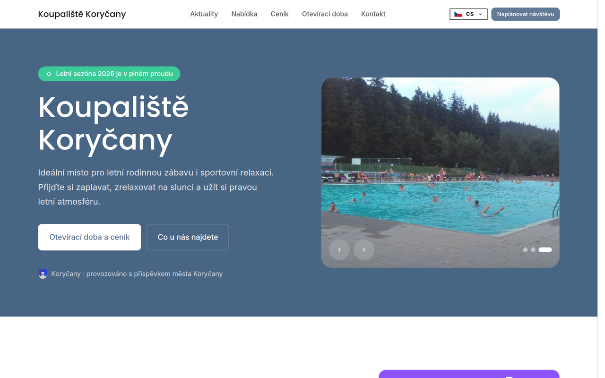
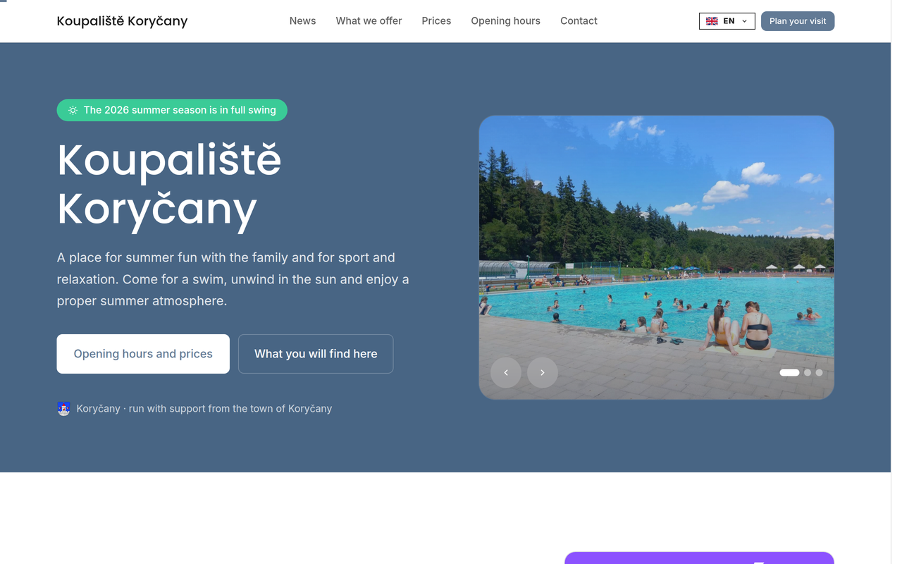
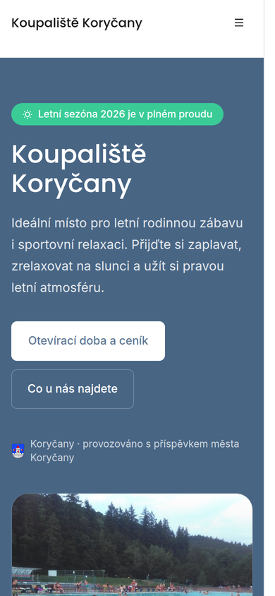

<div align="center">


**The website of Koupaliště Koryčany: a bilingual, prerendered page for the town's open air pool, with what the grounds offer, admission prices, the season's opening hours, current events and how to get in touch.**

[](LICENSE)
[](#install)
[](#runtime)

</div>

---

This repository owns what is specific to this site: the copy and its Czech and English translations, the eight sections, the season's dates and prices, the brand mark, and the design values in `.trebired/`. The `@trebired/*` packages own everything generic: the build, the browser runtime, locale routing, the slideshow, the gallery lightbox, SEO artifacts and logging. The pool's Facebook page owns the day-to-day opening status, which the page points to rather than repeats. The operator owns the Netlify site and the DNS record. This repository does not own a server, a database, ticketing or payments.

The output is static files. There is no backend, no contact form, no accounts and no analytics.

Koupaliště Koryčany is a Trebired product, licensed under the MIT License. See [LICENSE](LICENSE).

## Contents

- [Install](#install)
- [Quick Start](#quick-start)
- [Screens](#screens)
- [Concepts](#concepts)
- [Configuration](#configuration)
- [Runtime](#runtime)
- [Contributing](#contributing)
- [What It Does Not Do](#what-it-does-not-do)

## Install

Runtime support: Bun 1+.

```sh
bun i
```

## Quick Start

```sh
bun run dev
```

The dev server runs behind the Code Discipline gate and serves on port 3000. `bun run build` writes the client and one prerendered document per locale into `dist`, the directory Netlify publishes. `bun run verify` runs the discipline check, the typecheck and the build.

## Screens

Czech at `/` and English at `/en`, each served as its own prerendered document:

| | |
| --- | --- |
|  |  |

<div align="center">



</div>

## Concepts

### One page per locale, prerendered, then hydrated

`src/frontend/pages/home.tsx` composes eight sections: the hero, news, what the grounds offer, the gallery, prices, opening hours, food nearby and contact. At build time `src/frontend/ssr/entry.tsx` renders them once per locale inside `LocaleProvider`, and `@trebired/bundler` writes each into its own document with its own head tags. In the browser the header and footer hydrate as their own roots and the page body hydrates as a live island.

### Locale-prefixed routing

Czech is served at `/` and English at `/en`, each a separate prerendered document with its own `<html lang>`, title, description, canonical URL and `hreflang` set. `@trebired/frontend` owns the mechanism: a boot script in the head resolves the visitor's locale from storage or the browser and redirects before first paint, so the language is never corrected after the page is visible.

### Seasonal content

The season's dates are copy, so they live in the translation files: the badge in the hero, the current event in news, and the schedule in opening hours. Prices live in the pricing translations. [CONTRIBUTING.md](CONTRIBUTING.md#seasonal-updates) lists the exact files to edit each season.

### The slideshow

The hero uses the `@trebired/frontend` `Carousel` with its controls along the bottom. It advances every five seconds, pauses while the pointer or keyboard focus is on it, and holds still for visitors who ask for reduced motion.

## Configuration

Package behaviour is configured under `.trebired/`:

| File | Owns |
| --- | --- |
| `.trebired/frontend/config.ts` | Palette, fonts, favicon source, static icon specs, enabled systems |
| `.trebired/bundler/config.ts` | Frontend directory, build output directory, public path |
| `.trebired/seo/config.ts` | Site URL, locales, locale strategy, robots policy, sitemap defaults |
| `.trebired/i18n/config.ts` | Supported languages, fallback language, checker root |
| `.trebired/startup/config.ts` | Dev server port requirement and shutdown timeout |
| `.trebired/code-discipline/config.ts` | Preset and banned patterns |

The site is light only. Product and organization identity live in `package.json#config` and are injected as build-time defines. The contact e-mail is derived from the product domain and is never written as a literal. Contact details and external links live once in `src/frontend/shared/content.ts`.

## Runtime

The build emits an ES module client bundle, two stylesheets, the self hosted Inter and Poppins files, the rasterized favicon set, `robots.txt`, `sitemap.xml` and one prerendered HTML document per locale. Icons resolve from a build-generated static cache, so the page makes no icon requests. Netlify builds the site with the command and publish directory declared in `netlify.toml`.

## Contributing

See [CONTRIBUTING.md](CONTRIBUTING.md).

## What It Does Not Do

This application does not:

- Sell tickets or take payments. Admission is paid in cash at the entrance.
- Report whether the pool is open today. The Facebook page does, and the page links to it.
- Run a server, a database or any scheduled work. Every document is prerendered at build time.
- Collect anything. There is no contact form; visitors call or e-mail.
- Set analytics, advertising or tracking cookies.
- Ship a test suite. Verification is `bun run verify`.
